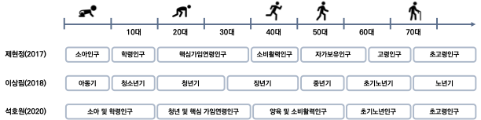

# 인구구조 기반 도시 유형화

## 1. 선행연구
### - 인구감소지역
- 행정안전부에서 5년 단위로 인구감소지역 지정하며, 2023년 9월 기준 89개의 도시가 인구감소지역으로 선정
- 인구감소지수는 총 8가지의 지표로 측정 됨 ①연평균인구증감률, ②인구밀도, ③청년순이동률, ④주간인구, ⑤고령화 비율, ⑥유소년 비율, ⑦조출생률, ⑧재정자립도
- 참고: 행정안전부 인구감소지역 지정 [[바로가기](https://www.mois.go.kr/frt/sub/a06/b06/populationDecline/screen.do)]

<figure align= 'center'>
    </img>
    <figcaption>그림1. 행안부 인구감소지역</figcaption>
</figure>

### - 인구구조 및 인구이동 데이터
- 선행연구 조사를 통해 인구구조 및 인구이동 연령층 선정
- 총 5개의 연령층과 외국인 인구를 본 연구에서 사용 ①신생아(0세), ②유소년인구(1세~14세), ③청년가임인구(20세~39세), ④소비활력인구(40세~59세), ⑤고령인구(65세 이상)

<figure align= 'center'>
    
    <figcaption>그림2. 인구 연령구분 선행연구</figcaption>
</figure>

## 2. 데이터
- 모든 데이터는 국가통계포털(KOSIS)에서 수집함
- (공간범위) 전국 229개 시군구의 인구 시계열 데이터를 기반으로 도시유형 분류 수행
- (시간범위) 2013년부터 2023년까지 전연령 인구 데이터
- 사회적 인구이동(전입인구 - 전출인구)
  • 1인 사회적 인구이동과 전체 사회적 인구이동은 클러스터분석에 주는 영향에 차이가 없음
  • 사회적 인구이동의 많은 분을 1인 사회적 인구이동이 차지하기 때문

## 3. 분석 방법론
### 3.1. 데이터 전처리
- 시계열 인구 데이터는 
### 3.2. TimeSeries K-Means Clustering
- Elbow Plot과 Shillhouette Plot 결과를 바탕으로 최적의 K 도출
- Euclidean Distance와 Dynamic Time Warping(DTW)의 차이

구분 | 유클리드거리 (Euclidean Distance) | 동적 시간 왜곡 (Dynamic Time Warping)
:-: | :-: | :-:
정의 | 시계열 각 지점의 거리의 합을 계산 | 시계열의 비선형적인 매핑을 허용하여 최적의 매칭을 찾음
특징 | 각 시점의 값들을 직접 비교 | 시계열 간의 시간적 변동성을 고려하여 비교
장점 | 계산이 빠르고 간단함 일반적인 시계열 데이터 분석에 적합 | 시간 축의 변동을 허용하여 더 유연한 매칭 제공 비슷한 패턴 감지 용이
단점 | 시간의 변동성이나 길이가 다른 시계열 데이터에 적용하기 어려움 | 계산 시간이 길고 복잡 큰 데이터 셋에는 접하지 않을 수 있음

## 4. K-Means Clustering
### 4.1. 최적의 K 찾기
#### - Elbow Method
* 

#### - Silhouette Plot
* 

## 5. 도시유형별 특징

## 최종 결과보고서

** 본 연구는 2023년도 한반도미래인구연구원 연구비 지원에 의한 연구임을 밝힙니다. (KPPIF 23-R04)