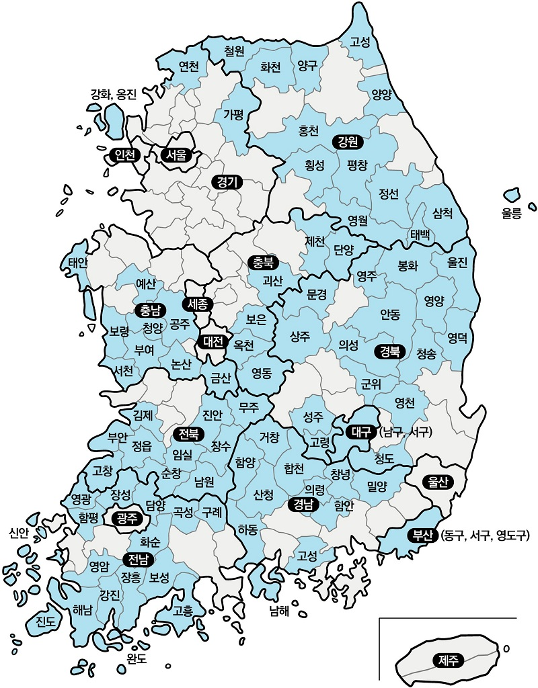

# 인구구조 기반 도시 유형화

## 1. 선행연구
### - 인구감소지역
* 행정안전부에서 5년 단위로 인구감소지역 지정하며, 2023년 9월 기준 89개의 도시가 인구감소지역으로 선정
* 인구감소지수는 총 8가지의 지표로 측정 됨 ①연평균인구증감률, ②인구밀도, ③청년순이동률, ④주간인구,  ⑤고령화 비율, ⑥유소년 비율, ⑦조출생률, ⑧재정자립도

    </img>

## 2. 데이터
- 모든 데이터는 국가통계포털(KOSIS)에서 수집함
- (1안) 출생아수, 가임여성인구, 고령인구, 유소년인구, 청년층 남여 인구비율
  • 가임여성인구 기준 : 20세 ~ 39세
  • 고령인구 기준 : 65세 이상
- (2안) 출생아수, 가임여성인구, 고령인구, 유소년인구, 청년층 남여 인구비율
  • 가임여성인구 기준 : 20세 ~ 44세
  • 고령인구 기준 : 70세이상
- (3안) 출생아수, 가임여성인구, 고령인구, 유소년인구, 청년층 남여 인구비율, 외국인 인구, 외국인 자녀 수(다문화 가정 자녀 수)

## 3. 분석 방법론
- Elobow Plot과 Shillhouette Plot 결과를 바탕으로 최적의 K 도출
- Euclidean Distance와 Dynamic Time Warping(DTW)의 차이

구분 | Euclidean Distance | Dynamic Time Warping
:-: | :-: | :-:
특징 | 1 | 2

## 4. K-Means Clustering
### 4.1. 최적의 K 찾기
#### - Elbow Method
* 

#### - Silhouette Plot
* 
