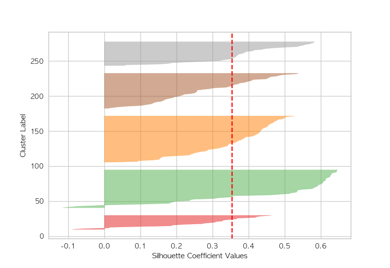

# 인구구조 기반 도시 유형화

## 1. 선행연구
### - 인구감소지역
- 행정안전부에서 5년 단위로 인구감소지역 지정하며, 2023년 9월 기준 89개의 도시가 인구감소지역으로 선정
- 인구감소지수는 총 8가지의 지표로 측정 됨 ①연평균인구증감률, ②인구밀도, ③청년순이동률, ④주간인구, ⑤고령화 비율, ⑥유소년 비율, ⑦조출생률, ⑧재정자립도
- 참고: 행정안전부 인구감소지역 지정 [[바로가기](https://www.mois.go.kr/frt/sub/a06/b06/populationDecline/screen.do)]

    
     그림1. 행안부 인구감소지역

### - 인구구조 및 인구이동 데이터
- 선행연구 조사를 통해 인구구조 및 인구이동 연령층 선정
- 총 5개의 연령층과 외국인 인구를 본 연구에서 사용

    
     그림2. 선행연구 인구 연령구분

## 2. 데이터
- 모든 데이터는 국가통계포털(KOSIS)에서 수집
- (공간범위) 전국 229개 시군구의 인구 시계열 데이터를 기반으로 도시유형 분류 수행
- (시간범위) 2013년부터 2022년까지 전연령 인구 데이터

    표1. 인구 연령구분
    <table align= 'center'>
        <tr>
            <th style= 'text-align:center'>구분</th>
            <th style= 'text-align:center' width= 200 >데이터</th>
            <th style= 'text-align:center'>연령기준</th>
        </tr>
        <tr>
            <th style= 'text-align:center'>1</th>
            <th style= 'text-align:center'>신생아 비율</th> 
            <th style= 'text-align:center'>0세</th>    
        </tr>
        <tr>
            <th style= 'text-align:center'>2</th> 
            <th style= 'text-align:center'>유소년인구 비율</th> 
            <th style= 'text-align:center'>1세 ~ 14세</th> 
        </tr>
        <tr>
            <th style= 'text-align:center'>3</th> 
            <th style= 'text-align:center'>청년가임인구 비율</th> 
            <th style= 'text-align:center'>20세 ~ 39세</th> 
        </tr>
        <tr>
            <th style= 'text-align:center'>4</th> 
            <th style= 'text-align:center'>소비활력인구 비율</th> 
            <th style= 'text-align:center'>40세 ~ 59세</th> 
        </tr>
        <tr>
            <th style= 'text-align:center'>5</th> 
            <th style= 'text-align:center'>고령인구 비율</th> 
            <th style= 'text-align:center'>65세 이상</th> 
        </tr>
        <tr>
            <th style= 'text-align:center'>6</th> 
            <th style= 'text-align:center'>외국인 비율</th> 
            <th style= 'text-align:center'>-</th> 
        </tr>
    </table>

## 3. 분석 방법론
### 3.1. 데이터 전처리
- 시계열 인구 데이터를 분석에 그대로 사용할 경우 도시유형이 도시의 규모로 묶이는 경향이 있어 각 도시의 인구비율로 데이터를 전처리하여 분석 진행
- 추가로 MinMax Scaler를 사용하여 인구비율 데이터를 추가로 전처리 진행

### 3.2. TimeSeries K-Means Clustering
- Elbow Plot과 Shillhouette Plot 결과를 바탕으로 최적의 K 도출
- 시계열의 거리 측정 방식에는 대표적으로 유클리드 거리(Euclidean Distance)와 동적 시간 왜곡(Dynamic Time Warping; DTW)가 있으며, 본 연구에서는 시계열의 비슷한 패턴을 바탕으로 도시유형화를 하기 위해 DTW를 사용

    표2. Euclidean Distance와 Dynamic Time Warping(DTW)의 차이
    <table align= 'center'>
        <tr>
            <th style= 'text-align:center'>구분</th>
            <th style= 'text-align:center'>유클리드거리 (Euclidean Distance)</th>
            <th style= 'text-align:center'>동적 시간 왜곡 (Dynamic Time Warping)</th>
        </tr>
        <tr>
            <th style= 'text-align:center'>정의</th>
            <th style= 'text-align:center'>시계열 각 지점의 거리의 합을 계산</th> 
            <th style= 'text-align:center'>시계열의 비선형적인 매핑을 허용하여 최적의 매칭을 찾음</th>    
        </tr>
        <tr>
            <th style= 'text-align:center'>특징</th> 
            <th style= 'text-align:center'>각 시점의 값들을 직접 비교</th> 
            <th style= 'text-align:center'>시계열 간의 시간적 변동성을 고려하여 비교</th> 
        </tr>
        <tr>
            <th style= 'text-align:center'>장점</th> 
            <th style= 'text-align:center'>계산이 빠르고 간단함 일반적인 시계열 데이터 분석에 적합</th> 
            <th style= 'text-align:center'>시간 축의 변동을 허용하여 더 유연한 매칭 비슷한 패턴 감지 용이</th> 
        </tr>
        <tr>
            <th style= 'text-align:center'>단점</th> 
            <th style= 'text-align:center'>시간의 변동성이나 길이가 다른 시계열 데이터에 적용하기 어려움</th> 
            <th style= 'text-align:center'>계산 시간이 길고 복잡 큰 데이터 셋에는 접하지 않을 수 있음</th> 
        </tr>
    </table>

## 4. K-Means Clustering
### 4.1. 최적의 K 찾기
- Elbow Method: Elbow 방법을 사용하여 최적의 K는 5로 정의
- Silhouette Plot: K가 5일 때의 Silhouette 점수를 확인하여 클러스터의 유효성 확인

    
    
     그림3. Inertia결과(좌), 실루엣 분석결과(K=5)(우)

## 5. 도시유형화 결과

    
     그림4. 도시유형화 시각화

## 최종 결과보고서 및 논문
- 인구특성변화 분석을 통한 도시유형 분류 및 지속가능성 진단(ISBN 979-11-984232-8-3)
- 김대환, 정광식, 남우민, 권영상, & 박건철. (2024). 인구특성 데이터 기반 대한민국 인구실태 분석: 229 개 기초지자체를 대상으로. 한국인구학, 47(3), 117-153.

** 본 연구는 2023년도 한반도미래인구연구원 연구비 지원에 의한 연구임을 밝힙니다. (KPPIF 23-R04)
